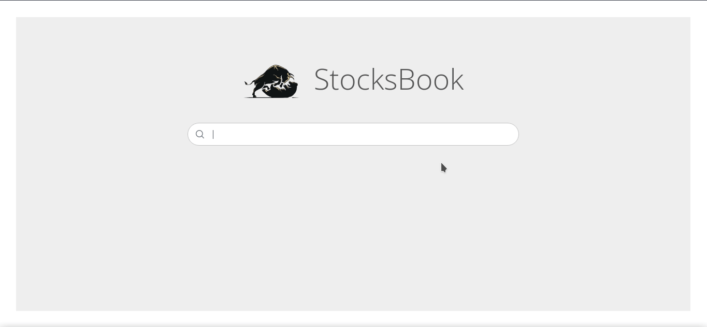

# StocksBook

StocksBook is an application used to view latest Bhavcopy equity data from BSE. Data such as Code, Name, Open, High, Low and Close can be viewed.

Updated data is fetched everyday at 18:00.

It is currently deployed on Azure platform using Azure App Service and Azure Cache for Redis.

Website: https://stocksbook.azurewebsites.net/

## Tech Stack

- Python 3.9
- Django 3.2
- Vue 3
- Redis
- Celery (Beat and Worker)

## Functionality Implemented

- Backend is coded using Python and Django.
- Fetch Bhavcopy from BSE website on weekdays at 18:00 using Celery worker (as markets are closed on weekends and Bhavcopy is not available).
- Extract CSV from ZIP file and parse the Bhavcopy data.
- Insert the Bhavcopy data after parsing into Redis using redis-py after deleting old data.
- Frontend is implemented in Vue and PrimeVue (for table).
- Frontend is responsive to support all screen sizes.
- Render a search bar in frontend where the stocks can be searched and the results are rendered in table format.
- Search is performed on Redis in the backend and results are cached for 300s for quick retrieval in immediate future.
- The results can be exported as a CSV file using a button provided.
- The website is deployed on Azure platform via Azure App Service and Azure Cache for Redis.
- Github actions is setup for Continuous Deployment on Azure on pushing the changes.
- docker-compose.yml file is created for easy setup in local development environment.

## Local Setup

The development setup can be done locally using docker by following the below steps:

1. Clone the repository

   `git clone https://github.com/BA1RY/stocks_book.git`

2. Move inside the cloned repositoty

   `cd stocks_book`

3. Run docker-compose to start development server

   `docker-compose up`

4. To stop the development server, run

   `docker-compose down`
